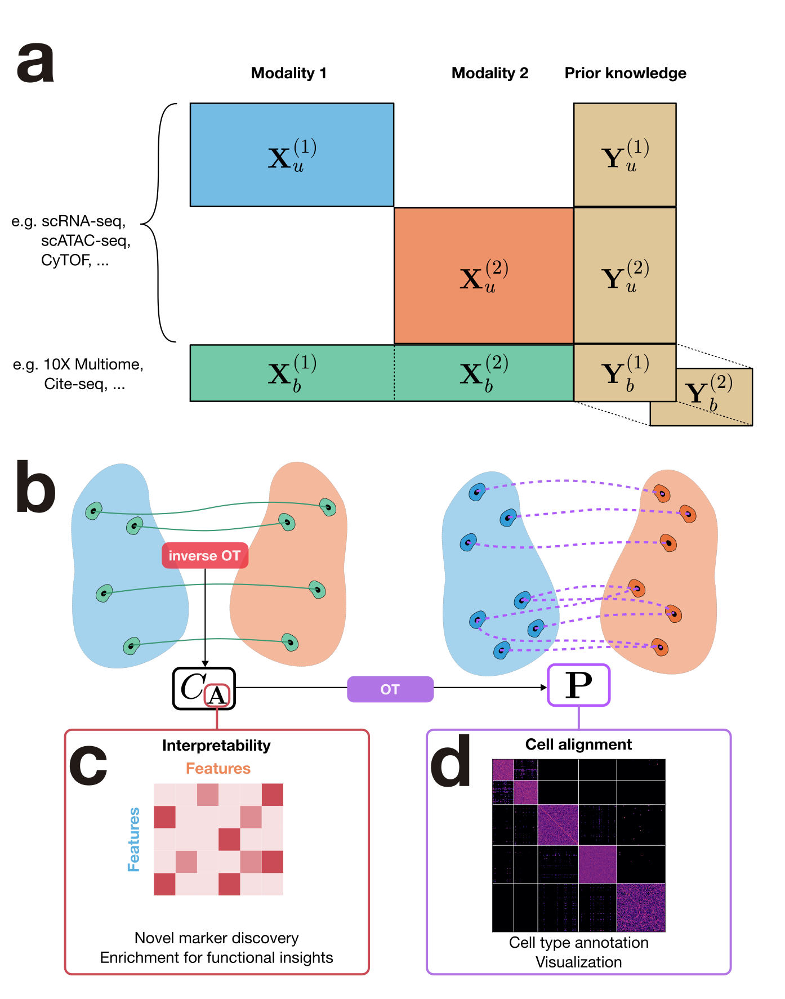

# Champollion

[](https://github.com/cantinilab/champollion/actions/workflows/tests.yml)
[](https://github.com/cantinilab/champollion/actions/workflows/lint.yml)
[](https://github.com/cantinilab/champollion/actions/workflows/docs.yml)
[](https://github.com/cantinilab/champollion/actions/workflows/build.yml)
[](https://codecov.io/gh/cantinilab/champollion)

Champollion learns an interpretable cross-modality cost from paired bridge cells and uses it to integrate unpaired single-cell profiles across modalities. It is designed for scverse workflows with `AnnData` and `MuData`, and exposes utilities for annotation transfer, barycentric projection, and interpretation of the learned interaction matrix.



## Install

The package is currently being prepared for its first public release. During development, install it from a local checkout:

```bash
git clone git@github.com:cantinilab/champollion.git
cd champollion
pip install .
```

Optional Weights & Biases logging can be installed with:

```bash
pip install "champollion[wandb]"
```

## Documentation

Documentation and tutorials are available at [champollion-omics.readthedocs.io](https://champollion-omics.readthedocs.io/en/latest/).

The PBMC tutorial included in `tutorials/pbmc_tutorial.ipynb` demonstrates fitting Champollion on bridge cells, transporting unpaired cells, transferring annotations, and building a joint visualization.


## Getting Started

Champollion is fitted on a paired bridge stored in a `MuData` object. It can then be applied to modality-specific `AnnData` objects containing unpaired cells.

```python
from champollion import Champollion

model = Champollion(
    epsilon=1.0,
    gamma=0.001,
    lambda_prior=20.0,
    use_keops=False,
    device="auto",
    random_state=0,
)

model.fit(
    mdata_bridge,
    x_mod="rna",
    y_mod="atac",
    x_rep="X_pca",
    y_rep="X_lsi",
    prior_x_rep="X_prior",
    prior_y_rep="X_prior",
)

result = model.transport(
    {"rna": adata_rna, "atac": adata_atac},
    reps={"rna": "X_pca", "atac": "X_lsi"},
    prior_reps={"rna": "X_prior", "atac": "X_prior"},
)

predicted_atac_labels = result.transfer_obs(
    key="cell_type",
    source="rna",
    kind="categorical",
)
```

The learned matrix can be inspected directly:

```python
A = model.A_dataframe()
top_links = model.top_interactions("CD18", modality="protein", k=10)
```

## Citation

The preprint is in preparation. Citation information will be added before the official release.
if you're looking for the repository to reproduce the results in the article, please see the [champollion_reproducibility](https://github.com/cantinilab/champollion_reproducibility) repository!
